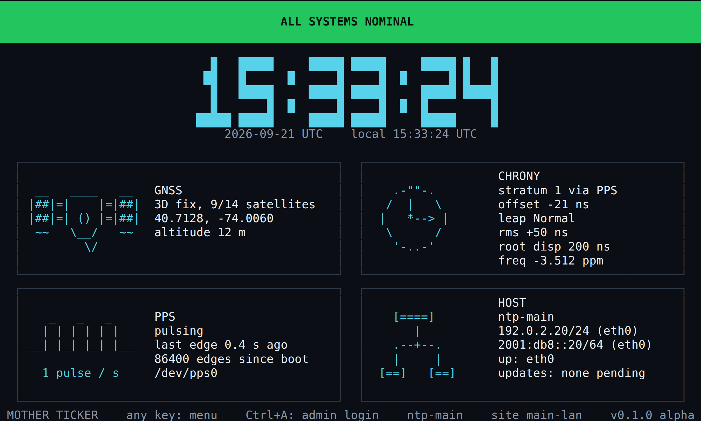
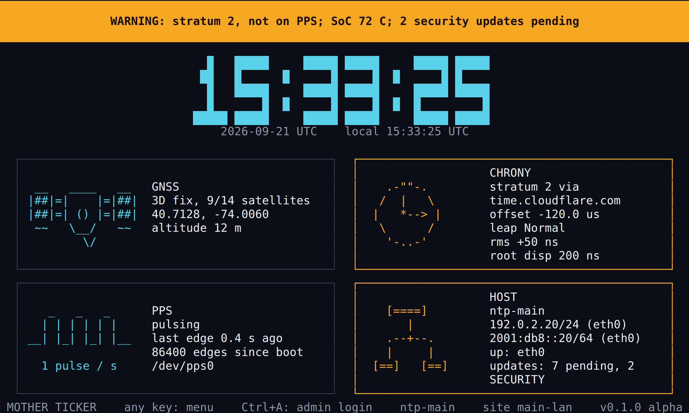
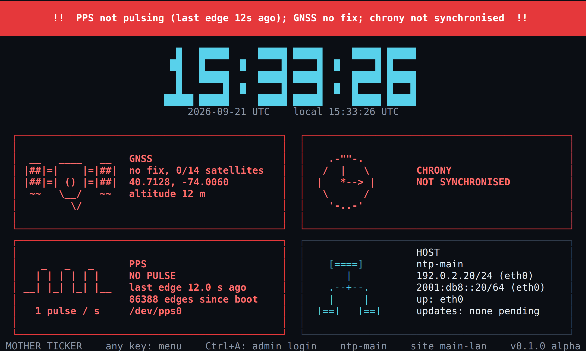
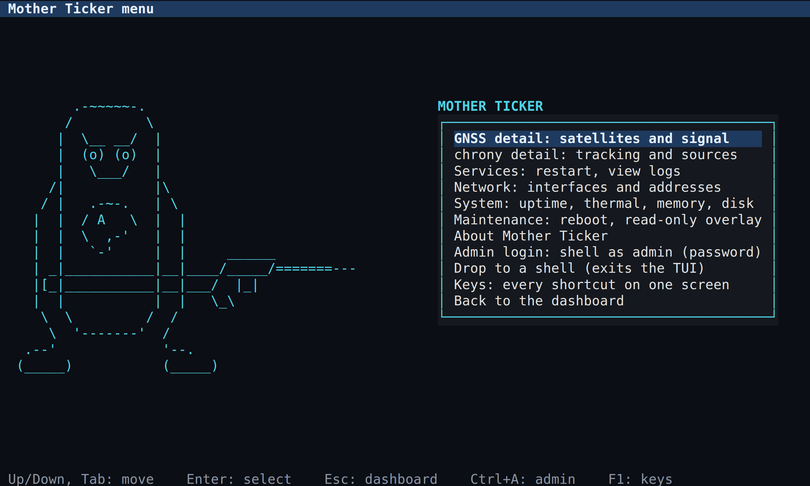
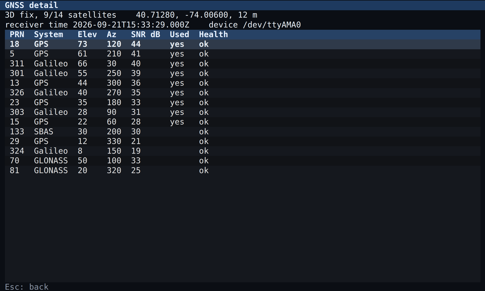
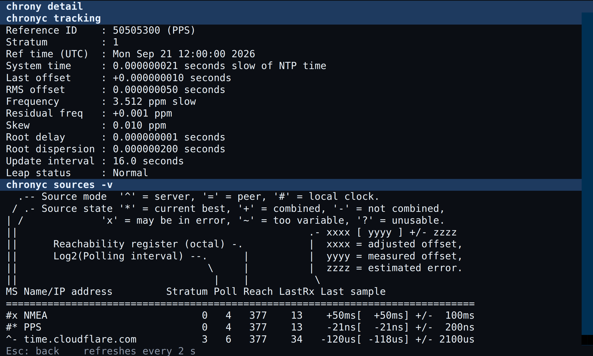
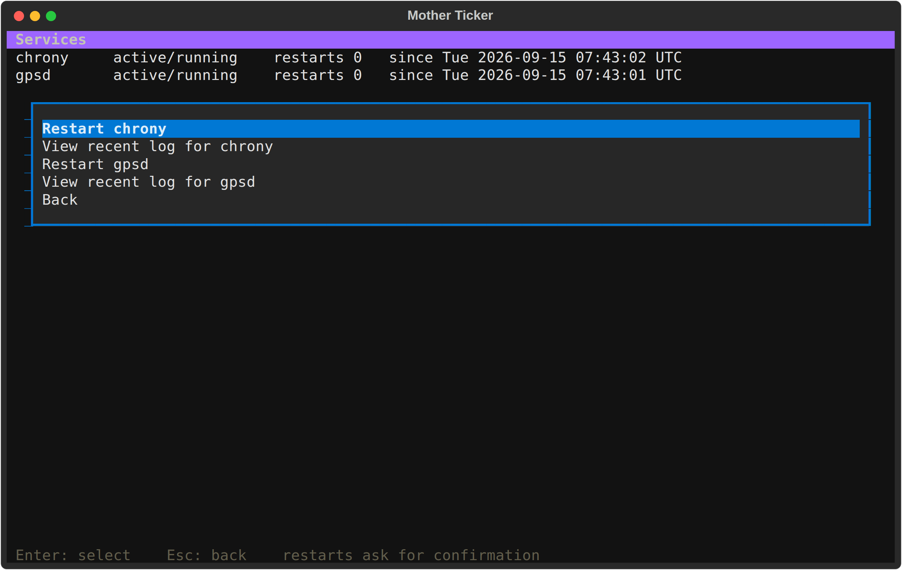
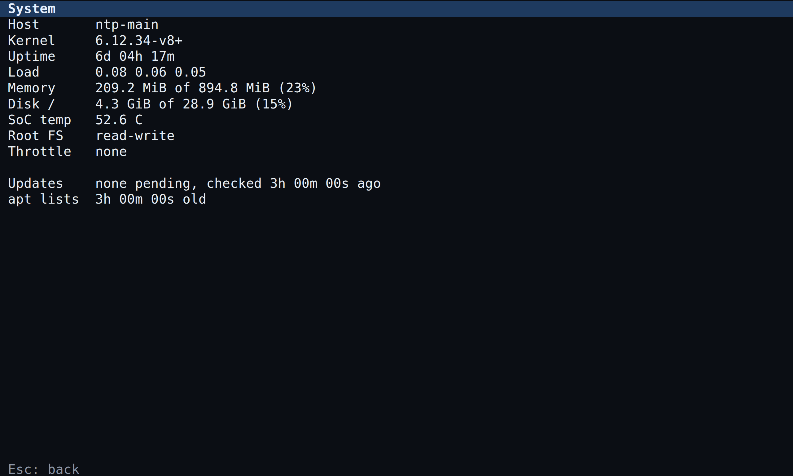
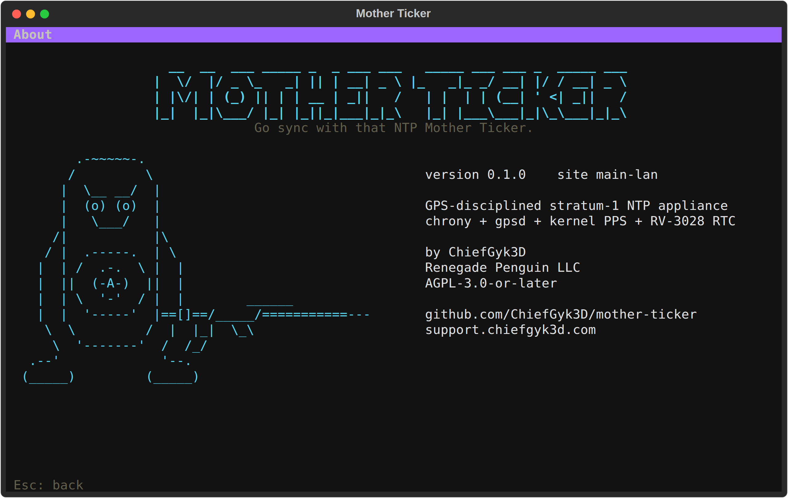

# Mother Ticker

> Go sync with that NTP Mother Ticker.


[](https://github.com/ChiefGyk3D/mother-ticker/actions/workflows/ci.yml)


GPS-disciplined stratum-1 NTP servers on Raspberry Pi 4, built as appliances:
chrony steered by a kernel PPS signal from a u-blox receiver, a real-time clock
for a plausible boot time, a status TUI on the unit's own 7 inch screen and
over SSH, metrics export that fits the network each unit lives on, and a host
hardened like something other machines trust for time.

Two units, one codebase. A `site` flag (`main-lan` or `malware-net`) decides
who may query, where metrics go and what chrony falls back to. A `mode` flag
(`appliance`, the default, or `dev`) decides how locked down the unit is.
Each unit is a standalone time clock: once it leaves the bench it may be
reachable only from its own segment, so it carries everything it needs to be
re-provisioned from its own shell, whichever way it was first deployed.

**Status: 0.1.0 alpha.** Everything here is tested in CI against recorded gpsd
and chrony output and rendered headless. It has not yet run on the target
hardware, and it stays alpha until it has: the items marked *verify on
hardware* below are what closes that. The running version and its lifecycle
label are in `mother-ticker --version`, the TUI's footer and About screen,
`CHANGELOG.md`, and the git tag; see `CONTRIBUTING.md` for the release
process.

## Contents

- [What you get](#what-you-get)
- [Hardware](#hardware)
- [Wiring and assembly](#wiring-and-assembly)
- [OS imaging](#os-imaging)
- [Deploying from a shell on the unit](#deploying-from-a-shell-on-the-unit)
- [Deploying with Ansible from a controller](#deploying-with-ansible-from-a-controller)
- [Per-site deployment](#per-site-deployment)
- [Using the TUI](#using-the-tui)
- [Screenshots](#screenshots)
- [Metrics](#metrics)
- [Updates](#updates)
- [Documentation map](#documentation-map)
- [Support this project](#-support-this-project)

## What you get

| Piece | What it does |
|---|---|
| `ansible/`, `scripts/install.sh` | One role that turns Raspberry Pi OS Lite into the appliance, driven either from a shell on the unit (`mother-ticker-install`, one box, nothing to learn) or from a controller with Ansible (several boxes): boot overlays, UART, gpsd, GNSS policy, chrony, RTC, nftables, sshd, fail2ban, watchdog, the TUI user and services, and the read-only overlay on the isolated unit. |
| `mother-ticker tui` | Textual TUI. Dashboard with clock, GNSS, chrony, PPS and network panels and a flashing banner on any fault. Any key opens a shallow menu: satellites, `chronyc` output, service restarts with confirmation, journal tails, network and system detail, maintenance. Same on tty1 and over SSH. |
| `mother-ticker exporter` | Prometheus `/metrics` on the main LAN; RFC 5424 syslog with a JSON body toward the one-way relay on the malware net. Same metric names on both. |
| `mother-ticker healthcheck` | Every 30 s from a systemd timer: evaluates health, restarts gpsd or chronyd after sustained faults a restart can fix, reboots after prolonged criticality with a boot-loop guard. The BCM2711 hardware watchdog backs it up. |
| `mother-ticker status` | One-shot text status; exit code is the health level. `ssh motherticker@unit status` works without a TUI. |

## Hardware

Per unit, both identical:

| Item | Notes |
|---|---|
| Raspberry Pi 4 Model B, 1 GB | 1 GB is enough: no desktop, no swap, the exporter is capped at 96 MB. |
| Uputronics GPS/RTC Expansion Board | u-blox M8 GNSS, Micro Crystal RV-3028-C7 RTC on I2C, PPS to a GPIO, UART to the Pi. |
| Active GNSS antenna, SMA | Needs sky view. A window sill works for a first fix; a roof or an outside wall works for timing. |
| Official Raspberry Pi 7 inch touchscreen (DSI) | Console only; there is no desktop. Touch is not used. Keyboard on USB when you want the menu locally. |
| SmartiPi Touch 2 case with the 35 mm back cover | The deeper cover clears the HAT. |
| microSD, 16 GB or larger, A2 rated | The isolated unit runs a read-only overlay, which is kind to the card. |
| Raspberry Pi OS Lite (64-bit), bookworm or trixie | No desktop environment. |

Optional: a USB keyboard per unit for the local menu, and an Ethernet cable
because Wi-Fi is disabled by the role.

## Wiring and assembly

The HAT sits on the 40-pin header; nothing else is wired by hand. What the
role configures, and where it comes from:

| Signal | Pi pins | Role setting | Where to verify |
|---|---|---|---|
| GNSS UART (NMEA and UBX) | GPIO14 TXD, GPIO15 RXD (pins 8, 10), `/dev/ttyAMA0` | `enable_uart=1`, `dtoverlay=disable-bt`, `hciuart` masked | Uputronics board page |
| PPS | GPIO18 (pin 12) | `dtoverlay=pps-gpio,gpiopin=18` | *verify on hardware*: `dmesg \| grep pps` then `ppstest /dev/pps0` |
| RTC (RV-3028-C7) | I2C1, GPIO2 SDA, GPIO3 SCL (pins 3, 5), address 0x52 | `dtparam=i2c_arm=on`, `dtoverlay=i2c-rtc,rv3028` | `i2cdetect -y 1` shows `UU` at 52 once the driver has it |
| Antenna | SMA on the HAT | none | `cgps` shows satellites within minutes outdoors |

Assembly order that works: fit the Pi into the SmartiPi frame, connect the DSI
ribbon and the display power leads, seat the HAT, fit the 35 mm cover, attach
the antenna, then power. The RTC has its own backup power on the board; check
the board's documentation for the cell or supercapacitor it uses before the
first long power-off.

Pi 4 thermal: in a closed case the SoC sits around 50 to 60 C idle. The TUI
warns at 70 and shows critical at 80, which is where the firmware throttles.

## OS imaging

1. Raspberry Pi Imager, choose **Raspberry Pi OS Lite (64-bit)**.
2. In the imager's settings: set the hostname (`ntp-main` or `ntp-malware`),
   create the admin user (the inventory calls it `admin`; any name works),
   **enable SSH with public-key authentication only** and paste your key.
   Do not configure Wi-Fi.
3. Boot the Pi on a network with internet (for the isolated unit too; see
   [Per-site deployment](#per-site-deployment)). Confirm `ssh admin@ntp-main`
   works with your key and that `sudo -n true` succeeds.

That is all the manual work on the unit. Everything else is the role.

## Deploying from a shell on the unit

One unit, no controller: everything runs on the Pi itself. The installer is a
shell script that reads a small config file, writes a one-host inventory, pulls
`ansible-core` from apt if it is missing, and runs the same role a controller
would, locally. There is one implementation of the appliance; this is just the
short way to drive it.

```sh
ssh admin@ntp-main
git clone https://github.com/ChiefGyk3D/mother-ticker
cd mother-ticker
cp install.conf.example install.conf
nano install.conf                      # site, subnets, relay, admin user
sudo scripts/install.sh --config install.conf
```

The config is `KEY=VALUE`, one per line, documented inline in
`install.conf.example`. Flags override it (`--site`, `--ntp-allow`,
`--relay-host`, `--tags`, `--check`, and the rest under `--help`). The
effective config is saved to `/etc/mother-ticker/install.conf`, and the role
installs the script as `mother-ticker-install`, so from then on:

```sh
sudo nano /etc/mother-ticker/install.conf   # change something
sudo mother-ticker-install                  # re-run; safe, changes only what differs
sudo mother-ticker-install --tags chrony    # or just one part
sudo mother-ticker-install --check          # or see what would change
```

What the run does is the same list as the Ansible section below, ending in one
reboot if boot configuration changed and a verification pass.

## Deploying with Ansible from a controller

Several units, or you already run Ansible: drive them from your laptop or an
admin box over SSH. If you have never used it: it is a list of steps in YAML,
each of which checks the current state and changes only what differs, so
re-running is always safe.

```sh
git clone https://github.com/ChiefGyk3D/mother-ticker
cd mother-ticker
scripts/setup-controller.sh      # venv with Ansible, private inventory, connectivity check
```

That script copies `ansible/inventory/example` to `ansible/inventory/local`,
which is gitignored. Edit three files there:

- `hosts.yml`: the units' addresses.
- `group_vars/mother_ticker.yml`: the admin user name and the upstream NTP
  servers for the main-LAN unit.
- `host_vars/ntp-main.yml` and `host_vars/ntp-malware.yml`: the site flag, the
  subnets allowed to query NTP and SSH, the Prometheus scraper, the relay.

Then:

```sh
cd ansible
../.venv/bin/ansible-playbook site.yml -l ntp-main
```

What happens, in order (each is a tag you can run alone with `-t`, from either
path):

1. `preflight`: refuses an overlay root, a non-Debian OS, or a missing admin user.
2. `packages`: chrony, gpsd, pps-tools, nftables, fail2ban and friends; removes
   `fake-hwclock`, avahi, ModemManager, Bluetooth, swap.
3. `boot`: the config.txt block above and the console release in cmdline.txt.
4. `rtc`, `gpsd`, `chrony`, `firewall`, `ssh`, `services`, `watchdog`, `app`.
5. One reboot if boot configuration changed.
6. `verify`: asserts chronyd runs as `_chrony`, that `/dev/pps0`, `/dev/rtc0`
   and `/dev/ttyAMA0` exist, that the services are active, and prints the
   unit's own status.
7. `overlay`: on the isolated unit only, enables the read-only overlay and
   reboots into it.

A fresh receiver takes minutes to a first fix and chrony needs a few more to
trust PPS, so the status at the end of a first run is usually a warning. Watch
the TUI or re-run `-t verify` later. `RUNBOOK.md` names every state.

## Appliance or dev

`mother_ticker_mode` (Ansible) or `MODE` (`install.conf`) is `appliance` by
default on both sites. That is the recommended way to run a unit that leaves
the bench:

| | `appliance` (default) | `dev` |
|---|---|---|
| Root filesystem | read-only overlay; updates through maintenance mode | read-write |
| apt timers | masked | as shipped |
| Journal | volatile | persistent, capped |
| TUI shell escape | off (admin login and admin SSH still give a shell) | on |
| Health ladder | restarts and reboots | restarts and reboots |

Use `dev` on the bench while you tinker, then switch back before the unit goes
into service: change the one value and re-run the installer or the play. Each
row is also its own variable (`mother_ticker_overlay`, `mother_ticker_mask_apt_timers`,
`mother_ticker_tui_allow_shell`, `mother_ticker_health_reboot_enabled`) if you
want to mix.

Whichever path deployed a unit, the role leaves the checkout at
`/opt/mother-ticker/repo`, installs `mother-ticker-install`, and writes
`/etc/mother-ticker/install.conf` from the values it was deployed with (never
overwriting an existing one). So a unit deployed from a controller can later
be re-provisioned, or switched between modes, from its own shell with no
controller in reach.

## Per-site deployment

The isolated unit has no internet, so it is **built on a network that has
some** and moved afterwards:

1. Image and boot it on the main LAN or a bench network with internet.
2. Deploy it as `malware-net`: `SITE=malware-net` in `install.conf` on the
   unit, or its own host_vars from a controller. The run installs packages
   from the internet, configures everything for the
   malware net (its subnets, the relay, orphan mode, no upstream servers) and
   ends by enabling the read-only overlay.
3. Power down, move it to the malware net, power up. Nothing on it needs the
   internet from then on, and nothing needs the controller: the unit carries
   its own installer and config.

Everything site-specific comes from the site flag or host_vars:

| Concern | `main-lan` | `malware-net` |
|---|---|---|
| chrony sources | PPS, plus two public servers as fallback | PPS only, `local stratum 10 orphan` if GPS is lost |
| `allow` and nftables | main LAN subnets | malware net subnet |
| Metrics | Prometheus `/metrics` on 9101, nftables-limited to the scraper | RFC 5424 syslog, JSON body, TCP or UDP, to the relay |
| Root filesystem, apt timers, journal, shell escape | by `mode` (appliance on both by default) | by `mode` |

Re-running against the isolated unit later needs maintenance mode first
(overlay off); from the unit itself that is `sudo mother-ticker-install`, from
a controller it needs a management-network path. See `docs/offline-updates.md`.

## Using the TUI

`ssh motherticker@ntp-main` lands on the dashboard. So does tty1 on the unit.
Your admin account keeps a normal shell.

- **Dashboard**: UTC clock, date and local time, GNSS fix and satellite counts,
  chrony stratum, reference, offset and leap status, PPS freshness, addresses.
  The banner across the top is green when everything is nominal, yellow and
  blinking on a warning, red and blinking on a critical fault (PPS gone, no
  fix, chrony unsynchronised, gpsd or chronyd down, SoC too hot). The version,
  site and hostname sit in the bottom right corner.
- **Any key** opens the menu. **Esc** goes back. Arrow keys or Tab move, Enter
  selects. Every restart and reboot asks for confirmation, and No is the
  default answer.
- Menu: GNSS detail (every satellite with elevation, azimuth, SNR, used),
  chrony detail (`chronyc tracking` and `chronyc sources -v` verbatim, refreshed
  every 2 s), services (restart chrony or gpsd, last 60 journal lines of each),
  network (every interface and address), system (uptime, load, memory, disk,
  temperature, throttling, overlay state), maintenance (reboot, overlay on or
  off), drop to a shell, back.
- **Ctrl+A, admin login.** From any screen, or from the menu: the TUI hands
  the terminal to `su - <admin user>`, which asks for the admin password, and
  you have that user's shell (with sudo) for debugging. `exit` returns to the
  TUI. Works the same with a keyboard plugged into the unit and over SSH, and
  in both modes, because the password is the gate. Set by `tui.admin_user`,
  which the role fills from the admin account.
- **F1 or ?** shows every key combo on one screen. The dashboard footer lists
  the ones that matter: any key for the menu, Ctrl+A for admin login, F1 for
  keys, Ctrl+Q to quit.
- **Ctrl+Q** quits the TUI outright. On tty1 systemd restarts it; over SSH the
  session ends.
- If the TUI itself is broken: Alt+F2 on the unit gives a login prompt on tty2
  for the admin user, and `ssh admin@unit` always gives a shell.

The Linux console has 16 colours and no mouse; the TUI is designed for that
and looks the same over SSH. The big clock is drawn with coloured cells
rather than glyphs, and every icon is plain ASCII, so the stock console font
renders all of it.

**Try it without hardware:** `mother-ticker tui --demo` runs the whole
interface with fabricated data on any Linux or macOS terminal.
`--demo warning` and `--demo critical` show the fault states.

## Screenshots

Rendered headless from the demo data by `make screenshots` (Textual draws
the SVG, Chromium rasterises it), so what is shown is what the code draws,
at the 7 inch panel's 100x30 cells.

**Dashboard, all systems nominal**



**Dashboard, warning: GPS lost, serving stratum 2 from a public server, SoC warm**



**Dashboard, critical: no PPS, no fix, chrony unsynchronised** (the banner
blinks; this is its steady half)



**Menu**



**GNSS detail**



**chrony detail**



**Services**



**System**



**About**



## Metrics

Every metric is prefixed `mother_ticker_` and labelled with `site`. The
important ones:

| Metric | Meaning |
|---|---|
| `mother_ticker_health_level` | 0 ok, 1 warning, 2 critical; the same evaluation that drives the banner |
| `mother_ticker_pps_pulsing`, `mother_ticker_pps_last_edge_age_seconds` | PPS freshness |
| `mother_ticker_gnss_fix_mode`, `mother_ticker_gnss_satellites_used` | receiver state |
| `mother_ticker_chrony_stratum`, `mother_ticker_chrony_system_offset_seconds`, `mother_ticker_chrony_synchronised` | what clients get |
| `mother_ticker_chrony_source_offset_seconds{source=...}` | per-source offsets, including the noselect NMEA source |
| `mother_ticker_soc_temperature_celsius`, `mother_ticker_throttled_flags` | thermal |

**main-lan**: scrape `http://ntp-main:9101/metrics`. Prometheus snippet:

```yaml
- job_name: mother-ticker
  static_configs:
    - targets: ["ntp-main:9101"]
```

**malware-net**: one syslog message per interval (15 s by default) to the
relay, RFC 5424 with a structured-data element and a JSON body. Severity
follows the health level (informational, warning, critical), so a SIEM can
alert on severity alone:

```
<134>1 2026-09-21T12:00:00.123456Z ntp-malware mother-ticker 812 metrics [mt@32473 site="malware-net" version="0.1.0"] {"chrony_stratum":1,"chrony_synchronised":1,"gnss_fix_mode":3,"pps_pulsing":1,...}
```

Transport (`tcp` or `udp`) and TCP framing (`newline` or `octet-counted`) are
host_vars. `mother_ticker_relay_send_failures` counts sends the relay refused.

## Update alerts

Nothing on a unit installs updates on its own; an appliance with a read-only
root cannot, and a time source should not surprise you. Instead a daily timer
(`mother-ticker-updates.timer`) refreshes the apt lists where it can, simulates
a dist-upgrade, and records how many packages would install and how many of
those are security updates. That state reaches you one way, through whatever
the unit already has:

- **Dashboard and system screen**: the host panel shows `updates: 7 pending,
  2 SECURITY`; a pending security update or a required reboot turns the banner
  yellow.
- **Metrics**: `mother_ticker_updates_pending`,
  `mother_ticker_security_updates_pending`, `mother_ticker_reboot_required`,
  `mother_ticker_updates_checked_timestamp_seconds`. Scraped on the main LAN;
  in the syslog JSON body on the malware net, so the SIEM sees them too.
- **Webhook (optional, main LAN)**: set `mother_ticker_alert_webhook_url` (or
  `ALERT_WEBHOOK_URL`) to an n8n webhook, an ntfy topic URL or a Grafana
  webhook contact point, and the exporter posts a JSON message when the
  health level crosses the floor (and when it recovers) and when new security
  updates appear. `docs/alerts.md` has the Grafana alert rule, the n8n and
  ntfy setups, email through either, and where Patch Gremlin fits.

## Updates

- Main LAN: maintenance is ordinary `apt`. Pull a new release and re-run
  `mother-ticker-install` (or the play) to update the application.
- Malware net: see `docs/offline-updates.md`. Short version: put the unit in
  maintenance mode (overlay off, reboot), update during a WAN window or from a
  bundle built on the main-LAN unit with `scripts/stage-offline-bundle.sh`,
  then maintenance mode off and reboot.

## Documentation map

| Document | Read it for |
|---|---|
| `ARCHITECTURE.md` | how chrony, gpsd, PPS and the RTC relate; TUI data flow; metrics paths per site; the health ladder |
| `RUNBOOK.md` | what a lost fix, a dead PPS and a desynchronised chrony look like, how to diagnose and recover each, and the other failure modes |
| `docs/alerts.md` | one-way alerting: metrics, syslog, webhook to n8n or ntfy, Grafana rules, email, Patch Gremlin |
| `docs/nts.md` | enabling Network Time Security for clients that support it |
| `docs/offline-updates.md` | pre-staging and WAN-window procedures for the isolated unit |
| `SECURITY.md` | reporting a vulnerability, what is in scope, the hardening in place |
| `CONTRIBUTING.md` | development setup, conventions, testing, release process, and that you keep your copyright |
| `CHANGELOG.md` | Keep a Changelog, SemVer |

## Licence

AGPL-3.0-or-later. See `LICENSE` and `NOTICE`. If you run a modified Mother
Ticker as a network service, section 13 of the AGPL asks you to offer its
source to that service's users.

---

Copyright (C) 2026 Renegade Penguin LLC. Mother Ticker is free software under
AGPL-3.0-or-later. There is [no CLA](CONTRIBUTING.md#you-keep-your-copyright).

---

## 💝 Support This Project

If you find Mother Ticker useful, consider supporting continued development.
Everything is also collected at **[support.chiefgyk3d.com](https://support.chiefgyk3d.com)**.

### Recurring Support

<div align="center">
<table>
  <tr>
    <td align="center" width="150">
      <a href="https://patreon.com/chiefgyk3d" title="Patreon">
        <br>
        <sub><b>Patreon</b></sub>
      </a>
    </td>
    <td align="center" width="150">
      <a href="https://streamelements.com/chiefgyk3d/tip" title="StreamElements">
        <br>
        <sub><b>StreamElements</b></sub>
      </a>
    </td>
    <td align="center" width="150">
      <a href="https://shop.chiefgyk3d.com/" title="Merch Store">
        <br>
        <sub><b>Merch Store</b></sub>
      </a>
    </td>
  </tr>
</table>
</div>

### Cryptocurrency Tips

<div align="center">
<table>
  <tr>
    <td>&nbsp;<b>Bitcoin</b><br><code>bc1qztdzcy2wyavj2tsuandu4p0tcklzttvdnzalla</code></td>
  </tr>
  <tr>
    <td>&nbsp;<b>Monero</b><br><code>84Y34QubRwQYK2HNviezeH9r6aRcPvgWmKtDkN3EwiuVbp6sNLhm9ffRgs6BA9X1n9jY7wEN16ZEpiEngZbecXseUrW8SeQ</code></td>
  </tr>
  <tr>
    <td>&nbsp;<b>Ethereum</b><br><code>0x554f18cfB684889c3A60219BDBE7b050C39335ED</code></td>
  </tr>
  <tr>
    <td>&nbsp;<b>Solana</b><br><code>5T8h3HbyvHgLxwXgchRYbHSqRjZyAr8J7uwjLN9Fh8Jh</code></td>
  </tr>
</table>
</div>

---

## 👤 Author & Socials

<div align="center">
<table>
  <tr>
    <td align="center" width="90"><a href="https://social.chiefgyk3d.com/@chiefgyk3d" title="Mastodon"><br><sub>Mastodon</sub></a></td>
    <td align="center" width="90"><a href="https://bsky.app/profile/chiefgyk3d.com" title="Bluesky"><br><sub>Bluesky</sub></a></td>
    <td align="center" width="90"><a href="https://twitch.tv/chiefgyk3d" title="Twitch"><br><sub>Twitch</sub></a></td>
    <td align="center" width="90"><a href="https://www.youtube.com/channel/UCvFY4KyqVBuYd7JAl3NRyiQ" title="YouTube"><br><sub>YouTube</sub></a></td>
    <td align="center" width="90"><a href="https://kick.com/chiefgyk3d" title="Kick"><br><sub>Kick</sub></a></td>
    <td align="center" width="90"><a href="https://www.tiktok.com/@chiefgyk3d" title="TikTok"><br><sub>TikTok</sub></a></td>
    <td align="center" width="90"><a href="https://www.instagram.com/chiefgyk3d" title="Instagram"><br><sub>Instagram</sub></a></td>
    <td align="center" width="90"><a href="https://www.threads.net/@chiefgyk3d" title="Threads"><br><sub>Threads</sub></a></td>
    <td align="center" width="90"><a href="https://discord.chiefgyk3d.com" title="Discord"><br><sub>Discord</sub></a></td>
    <td align="center" width="90"><a href="https://matrix-invite.chiefgyk3d.com" title="Matrix"><br><sub>Matrix</sub></a></td>
  </tr>
</table>
</div>

<div align="center"><sub>Made with ❤️ by <a href="https://github.com/ChiefGyk3D">ChiefGyk3D</a></sub></div>
